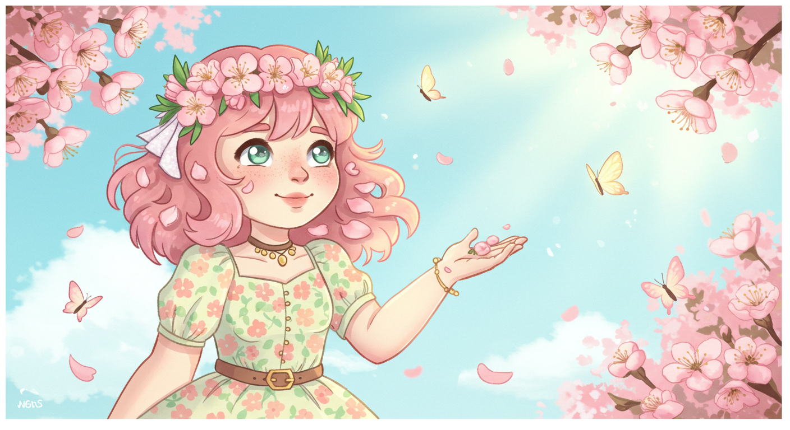

# 0327 
 미드저니,DID,스테이블 디퓨전, runway,(eleven lab-> 나의목소리학습)

 **1.이미지생성후 ai 수식어 붙여 동영상으로 변환**
(1)ai이미지 -봄 애니메이션
 

(2)video text
"Make the character’s hair gently wave as if a spring breeze is passing by. Add soft fluttering movement to the cherry blossom petals and butterflies. Let the sunlight shimmer slightly and create a dreamy glowing effect. The overall motion should be soft, slow, and peaceful, capturing the feeling of a warm spring day."

(3)동영상만들기

**2.텍스트 삽입 동영상 만들기**
여러 영상을 짜집기한 ai동영상이라서 아쉬움.

<video controls src="../mpg/invideo-ai-1080 Magical Spring Day with Pink-Haired Girl 2025-03-27.mp4" title="Title"></video>

**3.DID 아바타 이미지 생성후 텍스트 입력 동영상 만들기**
<video controls src="../mpg/3. DailyTest/Untitled video (1).mp4" title="Title"></video>

**4.텍스트를 음성으로 전환**
<audio controls src="../mpg/Text to Speech_Katie_안녕하세요 저는 한신대학교 재학..._2025-03-27.mp3" title="Title"></audio>

**5.일레븐랩그 음성파일 만든후 DID 아바타 만들기**
1.이미지-gpt 이용

2.동영상 
<video controls src="../mpg/3. DailyTest/Untitled video (1).mp4" title="Title"></video>